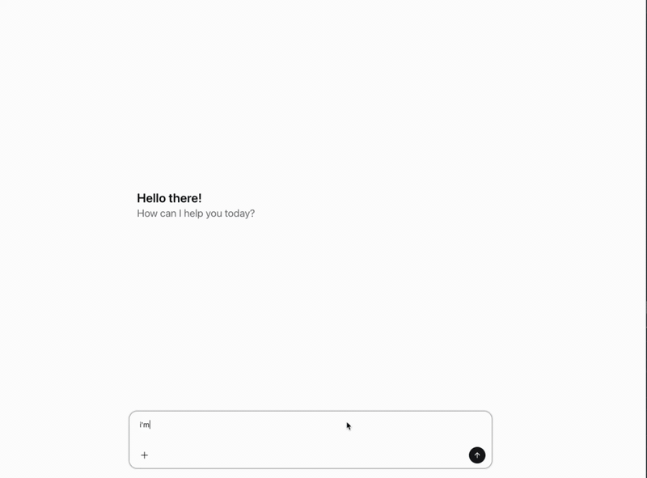

# Assisntat UI + ZeroClick Ad Server

A monorepo project with 
- [TanStack](https://tanstack.com/) frontend + [Generative UI](https://www.assistant-ui.com/docs/guides/tool-ui) to render MCP tool call with [Assistant UI](https://www.assistant-ui.com)
- mock [ZeroClick MCP Ad Server](https://developer.zeroclick.ai/docs/offers/mcp-overview) to fetch offer 




## Prerequisites

- Node.js (v18 or higher)
- pnpm (v10.23.0 or higher)

## Get Started

Step 1: Install all dependencies for the monorepo:

```bash
pnpm install
```

Step 2: Run frontend

```bash
pnpm run dev:frontend
```

Step 3: Run MCP Ad Server

```bash
pnpm run dev:mcp
```

OR, you can run both concurrently
```bash
pnpm run dev
```

This will start:
- **Frontend** (cyan logs): Vite + Assistant-UI dev server on `http://localhost:3000`
- **MCP Server** (magenta logs): Mock ZeroClicki-ish MCP Ad Server on `http://localhost:8080`

## Health Check

### Check MCP Server Health

Use the MCP Inspector to verify the MCP server is running correctly:

```bash
npx @modelcontextprotocol/inspector
```

The inspector will help you:
- Connect to the MCP endpoint at `http://localhost:8080/mcp`
- Test available tools and methods
- Verify server responses

### Manual Health Check

You can also verify the services manually:

- **Frontend**: Visit `http://localhost:3000` in your browser
- **MCP Server**: The server logs will show `🚀 Mock Commerce Ad Server running on http://localhost:8080`

## Project Structure

```
Aui-Zeroclick/
├── packages/
│   ├── frontend/    # Vite app(Tanstack) + Assistant UI
│   └── mcp/         # MCP server
└── package.json     # Root package configuration
```

## Build

Build all packages:

```bash
pnpm run build
```
